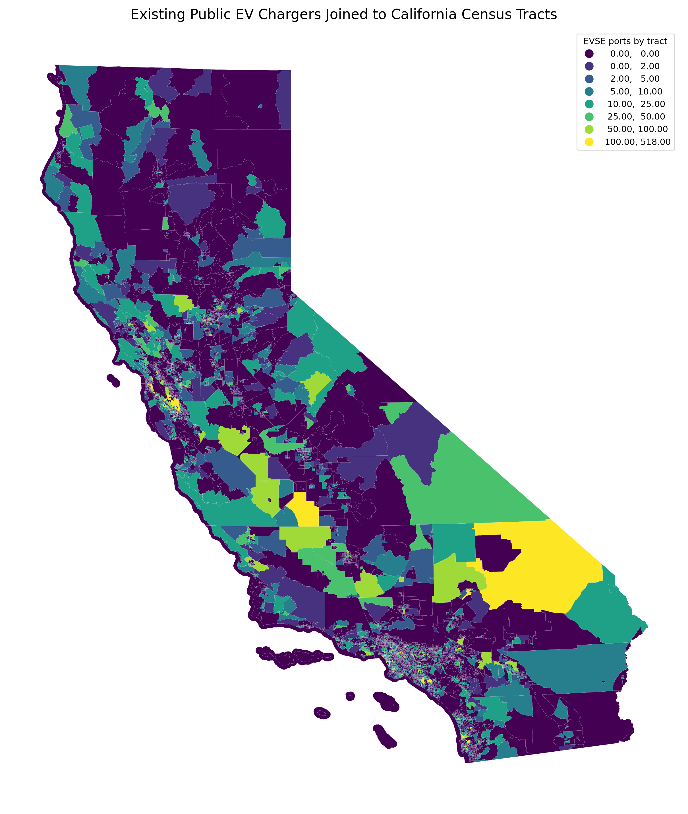
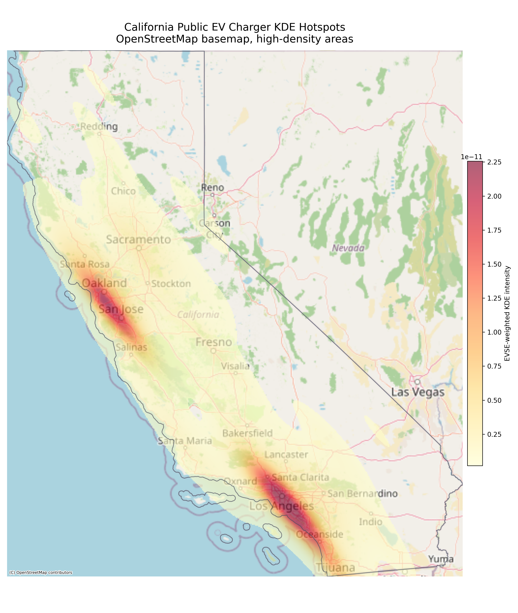
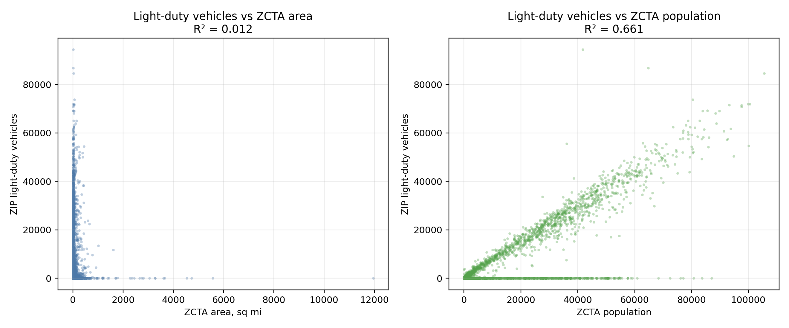
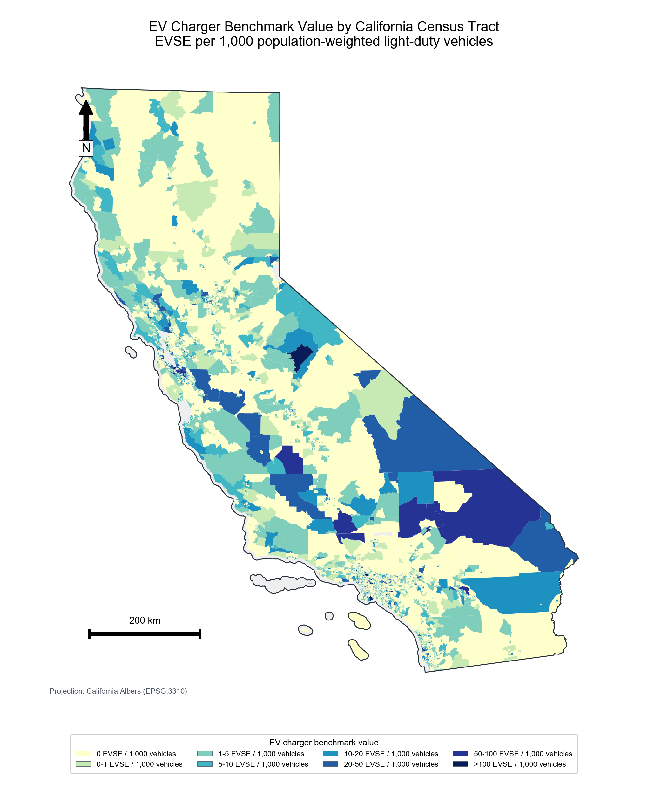
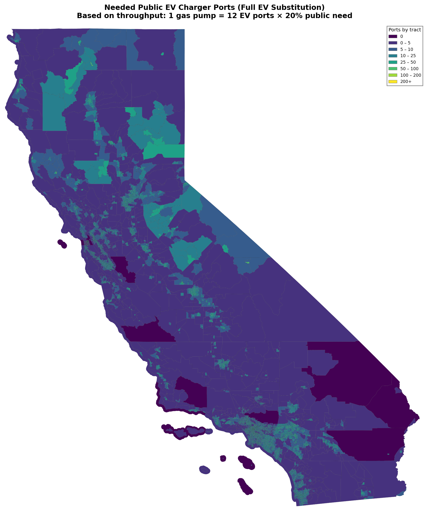
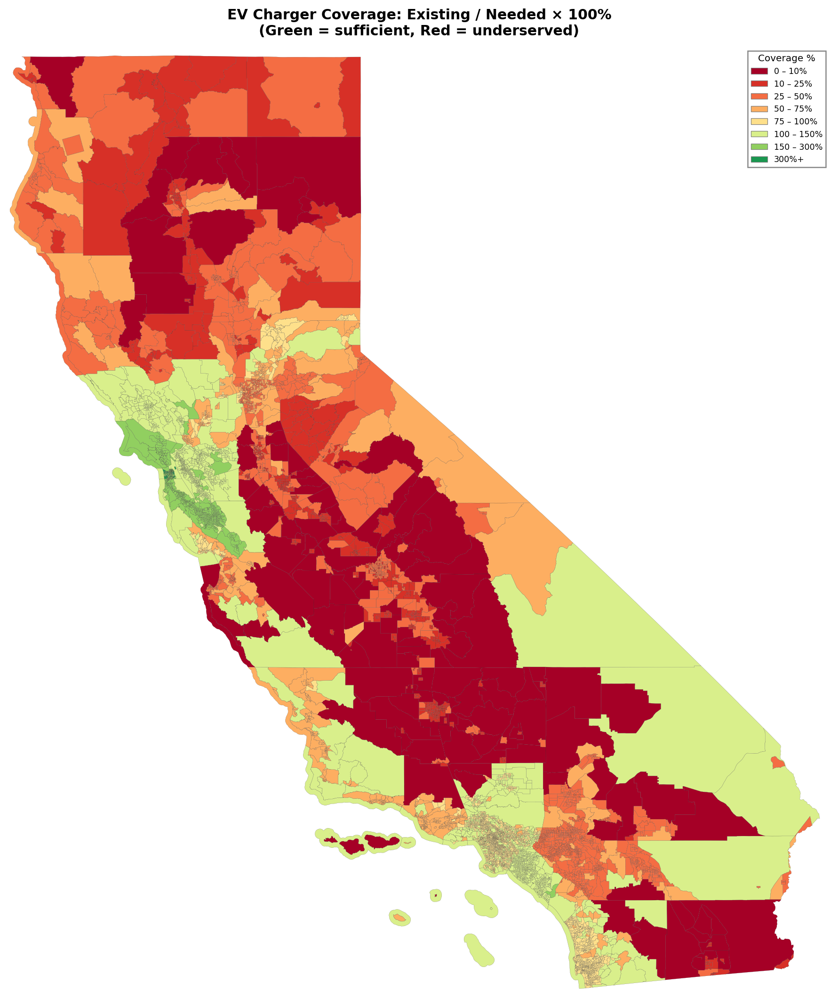
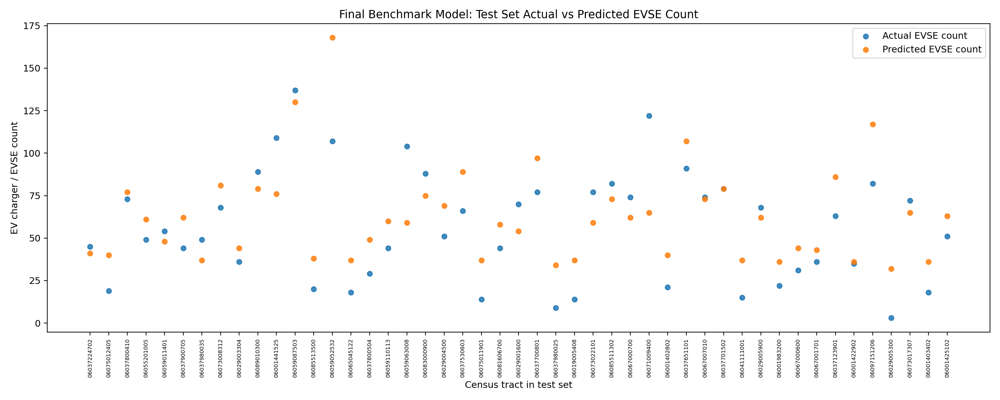
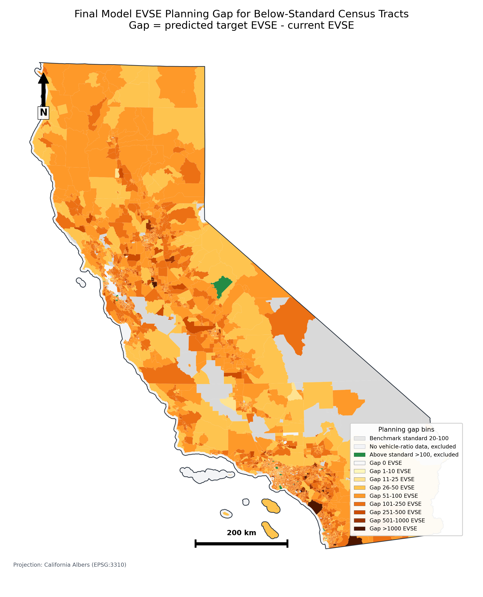

# California EV Charger Benchmark Planning Model

## Project Goal

This project builds a census tract-level EV charger planning model for California. The goal is not to forecast natural market demand. Instead, the project estimates how many EV charging ports each tract should have if it were planned toward a benchmark level already observed in better-served California tracts.

The final model uses current high-service tracts as a planning benchmark, applies that standard to below-standard California census tracts, and estimates the future EVSE planning gap:

```text
planning gap = max(0, predicted target EVSE count - current EVSE count)
```

The gap is an absolute EVSE count. It estimates how many additional public EVSE ports would be needed in a tract under the benchmark planning standard.

## Research Question

If California moves toward a future where electric vehicles replace gasoline vehicles, which census tracts are likely to need additional public EV charging infrastructure under a benchmark planning standard?

## Core Concept

The key benchmark variable is:

```text
ev_charger_benchmark_value
= EVSE per 1,000 light-duty vehicles
```

This value compares public EV charging infrastructure with the estimated number of light-duty vehicles in each census tract. It is used to define benchmark tracts, not as a direct claim of true market demand.

The final benchmark group is:

```text
20 <= ev_charger_benchmark_value <= 100
```

Tracts below 20 are the final model application group for gap estimation. Tracts above 100 are treated as above-standard high-ratio cases: they are displayed separately on the map and excluded from both benchmark training and gap statistics.

## Final Workflow

### 1. Join Existing Chargers to Census Tracts

Existing public charger points are spatially joined to California census tract polygons. This produces tract-level charger counts and EVSE counts.

Key output:

```text
outputs/figures/ca_tract_charger_join_map.png
outputs/tables/stage1_charger_join_summary.csv
data/processed/ca_tract_charger_join_with_kde.csv
data/processed/ca_tract_charger_join_with_kde.gpkg
```

This step validates that point-level charger locations have been correctly converted into tract-level infrastructure measures.



### 2. Show Current Charger Concentration

KDE maps are used to show that current EV chargers are concentrated in major urban areas and transportation corridors. This motivates the planning question: many tracts have very low existing charger coverage, but future EV adoption may require broader infrastructure.

Key outputs:

```text
outputs/figures/ca_ev_charger_kde_osm_basemap.png
outputs/figures/benchmark_regions_kde_osm_basemap.png
```



### 3. Allocate Vehicle Counts From ZIP/ZCTA to Census Tracts

California vehicle registration data are available at the ZIP level. Because the modeling unit is the census tract, ZIP-level light-duty vehicle and EV counts are allocated to tracts.

Two allocation weights were compared:

```text
area-weighted allocation
population-weighted allocation
```

The diagnostic result showed that ZIP-level light-duty vehicles are much more strongly related to population than land area:

```text
R-squared with area:       about 0.012
R-squared with population: about 0.661
```

Therefore, the project uses population-weighted allocation.

Key outputs:

```text
outputs/figures/zip_light_duty_vehicle_r2_area_vs_population.png
outputs/tables/vehicle_allocation_weight_r2_comparison.csv
data/processed/zip_vehicle_area_population_diagnostics.csv
```



### 4. Calculate EV Charger Benchmark Value

For each tract:

```text
ev_charger_benchmark_value
= total_evse / light_duty_vehicles_population_weighted * 1000
```

This gives EVSE per 1,000 light-duty vehicles.

Key outputs:

```text
data/processed/ca_tract_evse_vehicle_ratio_results.csv
outputs/figures/ca_ev_charger_benchmark_value_by_tract.png
outputs/tables/ev_charger_benchmark_value_10_interval_counts.csv
outputs/tables/ca_tract_evse_per_1000_vehicle_ranking.csv
```



### 5. Naive Baseline Plan for Comparison

In addition to the benchmark model, the project includes a simple baseline planning method. This baseline is used as a reference point, not as the final recommended model.

The naive baseline starts from gasoline infrastructure and asks how many public EV charging ports would be needed if gasoline vehicles were replaced by EVs.

Baseline assumptions:

```text
1 gasoline pump ~= 12.2 EV charging ports by throughput equivalence
Public charging need share = 20%
needed public EV ports = gas nozzles * 12.2 * 0.20
```

The baseline is useful because it gives a transparent rule-based comparison. However, it is less tract-specific than the final benchmark model because it begins from county-level gas nozzle estimates and allocates results to tracts using a proxy.

Key outputs:

```text
outputs/figures/naive_baseline_needed_ports_map.png
outputs/figures/naive_baseline_coverage_map.png
src/ca_ev_charger_needs_analysis.ipynb
```

Interpretation:

```text
Naive baseline = simple gas-station replacement reference
Final benchmark model = tract-level planning target estimated from current high-service EV charger tracts
```





### 6. Define Benchmark Training Tracts

The benchmark tracts are current California tracts with:

```text
20 <= ev_charger_benchmark_value <= 100
```

These tracts represent places that already have relatively high charger provision compared with their estimated light-duty vehicle base. They are used as the planning standard for the supervised model.

Final benchmark sample:

```text
Benchmark tracts: 188
Training tracts: 141
Testing tracts: 47
```

### 7. Train Final Model

The model predicts tract-level EVSE count under the benchmark planning standard.

Final target:

```text
total_evse
```

Final input features:

```text
population
tract_area_sq_mi
light_duty_vehicles_population_weighted
ev_vehicles_population_weighted
```

Final model:

```text
Ridge regression with standardized inputs and log-transformed target
```

The log target reduces the effect of very large EVSE counts while still predicting charger count as the final output.

Key script:

```text
src/final_benchmark_gap_model.py
```

Key outputs:

```text
outputs/tables/final_scale_model_performance.csv
outputs/tables/final_scale_model_test_set_predictions.csv
outputs/figures/final_scale_model_test_set_predicted_vs_actual.png
```



Final test-set performance:

```text
MAE:  17.38
RMSE: 21.44
R2:   0.55
```

### 8. Apply Model to Below-Standard Tracts

After training on benchmark tracts, the model is applied to below-standard California tracts:

```text
ev_charger_benchmark_value < 20
```

For each below-standard tract:

```text
predicted target EVSE count = model output
current EVSE count = existing public EVSE count
planning gap = max(0, predicted target EVSE count - current EVSE count)
```

Benchmark tracts are shown in gray on the final gap map because they are the training standard, not the main application group. Tracts above 100 are shown as above-standard and are not included in the gap total.

Final statewide application:

```text
Below-standard gap application tracts: 8,871
Benchmark standard tracts, 20-100: 188
Above-standard tracts, >100: 21
Total planning gap in below-standard tracts: 874,469 EVSE
```

Key outputs:

```text
data/processed/final_scale_model_statewide_gap_results_nonbenchmark_flagged.csv
outputs/figures/final_scale_model_nonbenchmark_gap_map.png
outputs/figures/top_zero_current_nonbenchmark_gap_tracts.png
outputs/tables/final_scale_model_gap_bin_counts.csv
outputs/tables/top_100_nonbenchmark_gap_tracts.csv
outputs/tables/top_100_zero_current_nonbenchmark_gap_tracts.csv
```



The final gap map uses binned colors so that extreme high-gap tracts do not dominate the visualization:

```text
0
1-10
11-25
26-50
51-100
101-250
251-500
501-1000
>1000
```

## Interpretation

This project should be interpreted as a benchmark-based planning analysis.

It answers:

```text
If other California census tracts were planned toward the charger-to-vehicle levels
already observed in better-served tracts, how many EVSE would they need?
```

It does not answer:

```text
What is exact natural market demand today?
What is the equilibrium number of chargers in every tract?
Should every tract necessarily match the same charger ratio?
```

The output is a planning target and gap estimate, not a direct demand forecast.

## Method Development Notes

The final workflow came from several rounds of modeling and interpretation.

First, a simple linear regression approach was considered. This was attractive because it was easy to explain, but the initial model fit was weak: the R-squared values were too low to support the planning interpretation by themselves. That result suggested that raw tract-level variables and current charger count did not have a clean linear relationship across all California tracts.

Second, a naive baseline plan was added as a transparent reference case. This baseline converts gasoline station capacity into EV charging capacity using a throughput assumption:

```text
1 gasoline pump ~= 12.2 EV ports
needed public EV ports = gas nozzles * 12.2 * 0.20
```

The baseline is useful for comparison because it shows what a simple gasoline-replacement rule would imply. However, it is not the final model because it relies on county-level gas nozzle assumptions and proxy allocation to tracts.

Third, the final benchmark model was reframed around current high-service EV charger tracts. Instead of predicting natural demand directly, the model learns from tracts with `ev_charger_benchmark_value` between 20 and 100. The final model uses scale variables and a log-transformed target to reduce the influence of very large charger counts. This produced a more stable test-set result:

```text
R2 = 0.55
```

This is why the final result is presented as a benchmark-based planning estimate rather than a pure demand forecast.

## Current Project Structure

```text
data/
  raw/
    cec_existing_public_chargers.geojson
    dmv_vehicle_counts_by_zip_2024.csv
    tl_2024_06_tract.zip
    tl_2024_us_zcta520.zip
    census_tract_boundaries/
    zcta_boundaries/

  processed/
    ca_tract_charger_join_with_kde.csv
    ca_tract_charger_join_with_kde.gpkg
    ca_tract_evse_vehicle_ratio_results.csv
    final_scale_model_statewide_gap_results_nonbenchmark_flagged.csv

outputs/
  figures/
    ca_tract_charger_join_map.png
    ca_ev_charger_kde_osm_basemap.png
    benchmark_regions_kde_osm_basemap.png
    naive_baseline_needed_ports_map.png
    naive_baseline_coverage_map.png
    zip_light_duty_vehicle_r2_area_vs_population.png
    ca_ev_charger_benchmark_value_by_tract.png
    final_scale_model_test_set_predicted_vs_actual.png
    final_scale_model_nonbenchmark_gap_map.png
    top_zero_current_nonbenchmark_gap_tracts.png

  tables/
    stage1_charger_join_summary.csv
    vehicle_allocation_weight_r2_comparison.csv
    ev_charger_benchmark_value_10_interval_counts.csv
    ca_tract_evse_per_1000_vehicle_ranking.csv
    final_scale_model_performance.csv
    final_scale_model_test_set_predictions.csv
    final_scale_model_gap_bin_counts.csv
    top_100_nonbenchmark_gap_tracts.csv
    top_100_zero_current_nonbenchmark_gap_tracts.csv

src/
  build_charger_tract_outputs.py
  make_kde_basemap_maps.py
  build_vehicle_ratio_tract_results.py
  final_benchmark_gap_model.py
  ca_ev_charger_needs_analysis.ipynb
```

## Reproduce Final Model

Run:

```bash
python src/final_benchmark_gap_model.py
```

This regenerates:

```text
outputs/figures/final_scale_model_test_set_predicted_vs_actual.png
outputs/figures/final_scale_model_nonbenchmark_gap_map.png
outputs/figures/top_zero_current_nonbenchmark_gap_tracts.png
outputs/tables/final_scale_model_performance.csv
outputs/tables/final_scale_model_test_set_predictions.csv
outputs/tables/final_scale_model_gap_bin_counts.csv
outputs/tables/top_100_nonbenchmark_gap_tracts.csv
outputs/tables/top_100_zero_current_nonbenchmark_gap_tracts.csv
data/processed/final_scale_model_statewide_gap_results_nonbenchmark_flagged.csv
```

## Limitations

- The benchmark value depends on currently observed charger and vehicle data, so it reflects present infrastructure patterns as well as planning need.
- ZIP-level vehicle data must be allocated to census tracts; population-weighted allocation is empirically stronger than area weighting but is still an estimate.
- The model uses scale variables and does not include detailed land use, employment centers, retail activity, traffic flow, tourism, or charging behavior.
- Very high benchmark values may reflect special locations such as commercial centers, highway corridors, airports, or data artifacts; values above 100 are excluded from benchmark training.
- The final gap should be read as a benchmark planning gap, not as a guaranteed construction requirement.
- The naive baseline plan is included only as a rule-based comparison. It depends on gasoline nozzle assumptions and county-to-tract allocation, so it should not be interpreted as the final tract-level planning estimate.

## References

California Department of Motor Vehicles. (2024). *Vehicle registration data by ZIP code*. California Open Data Portal. https://data.ca.gov/

California Energy Commission. (2024). *Assembly Bill 2127 second electric vehicle charging infrastructure assessment: Assessing charging needs to support zero-emission vehicles in 2030 and 2035* (CEC-600-2024-003). https://www.energy.ca.gov/publications/2024/assembly-bill-2127-second-electric-vehicle-charging-infrastructure-assessment

California Energy Commission. (2024). *EV charging infrastructure needs: Baseline scenario*. AB 2127 dashboard. https://www.energy.ca.gov/data-reports/data-exploration-tools/ab-2127-ev-charging-infrastructure-report-dashboards/ab-2127-ev

European Alternative Fuels Observatory. (2026). *Target tracker: AFIR fleet-based target*. https://alternative-fuels-observatory.ec.europa.eu/transport-mode/road/european-union-eu27/target-tracker

European Commission. (2023). *Alternative fuels infrastructure regulation*. Directorate-General for Mobility and Transport. https://transport.ec.europa.eu/transport-themes/clean-transport/alternative-fuels-sustainable-mobility-europe/alternative-fuels-infrastructure_en

National Renewable Energy Laboratory. (n.d.). *EVI-Pro: Electric Vehicle Infrastructure Projection Tool*. https://www.nrel.gov/transportation/evi-pro

OpenStreetMap contributors. (n.d.). *OpenStreetMap*. https://www.openstreetmap.org/

U.S. Census Bureau. (2024). *American Community Survey 5-year estimates, 2024: Detailed tables*. https://api.census.gov/data/2024/acs/acs5.html

U.S. Census Bureau. (2024). *TIGER/Line shapefiles: Census tracts, 2024*. https://www2.census.gov/geo/tiger/TIGER2024/TRACT/

U.S. Census Bureau. (2024). *TIGER/Line shapefiles: ZIP Code Tabulation Areas, 2024*. https://www2.census.gov/geo/tiger/TIGER2024/ZCTA520/

Brown, A., Cappellucci, J., White, E., Heinrich, A., & Cost, E. (2023). *Electric vehicle charging infrastructure trends from the Alternative Fueling Station Locator: Fourth quarter 2022* (NREL/TP-5400-85801). National Renewable Energy Laboratory. https://doi.org/10.2172/1974577

Wood, E., Borlaug, B., Moniot, M., Lee, D.-Y., Ge, Y., Yang, F., & Liu, Z. (2023). *The 2030 national charging network: Estimating U.S. light-duty demand for electric vehicle charging infrastructure* (NREL/TP-5400-85654). National Renewable Energy Laboratory. https://doi.org/10.2172/1988020

Xylia, M., Olsson, E., Macura, B., & Nykvist, B. (2025). Estimating charging infrastructure demand for electric vehicles: A systematic review. *Energy Strategy Reviews, 59*, 101753. https://doi.org/10.1016/j.esr.2025.101753
